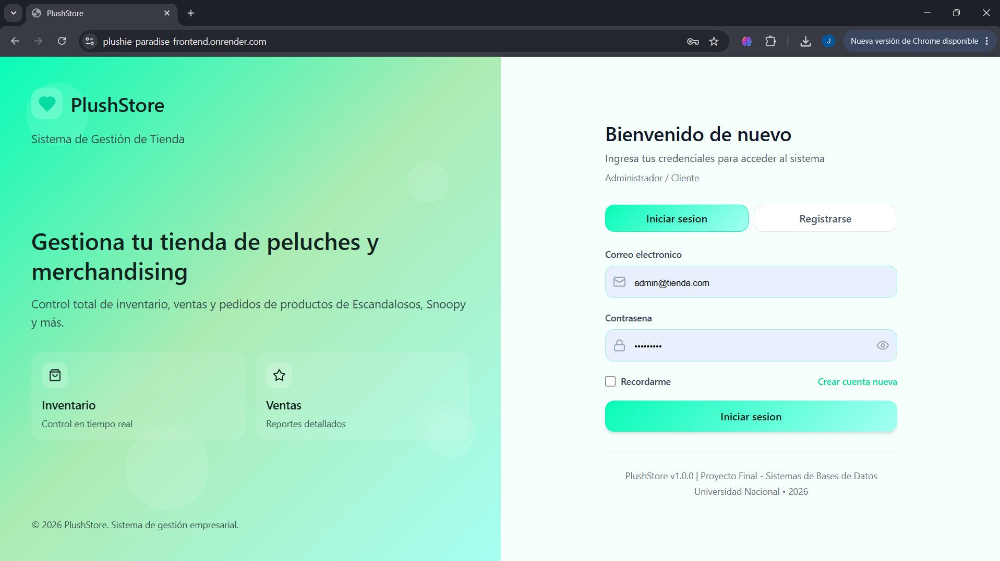
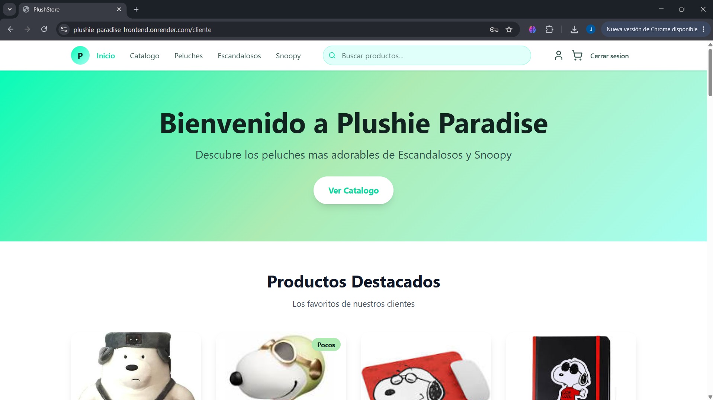

# Plushie Paradise

E-commerce full stack para venta de peluches y merchandising de Escandalosos y Snoopy. El proyecto incluye frontend React/Vite, backend Node.js/Express, API REST, autenticacion por roles, PostgreSQL, reportes administrativos, exportaciones CSV/PDF, Docker Compose para desarrollo local y despliegue separado en Render.

## Enlaces de producción

Frontend:
https://plushie-paradise-frontend.onrender.com

Backend/API:
https://plushie-paradise-api.onrender.com

Health Check:
https://plushie-paradise-api.onrender.com/api/health

Repositorio:
https://github.com/EmilioChenf/Proyecto-2-E-commerce-Chen




> Las capturas deben colocarse en `docs/images/login.png` y `docs/images/cliente.png`.

## Tecnologías

- React 18, Vite y TypeScript
- React Router
- React Context y hooks
- Vitest
- ESLint
- Node.js 20 y Express
- PostgreSQL 16
- SQL explicito sin ORM
- Docker Compose
- Nginx para servir frontend en Docker
- Render Web Service, Static Site y Render Postgres

## Arquitectura

El frontend consume exclusivamente la API REST del backend mediante Axios centralizado en `frontend/src/services/api.ts`. El backend expone rutas bajo el prefijo `/api`, responde JSON y se conecta a PostgreSQL mediante `pg`.

En local, Docker Compose levanta tres servicios:

- `db`: PostgreSQL con usuario `proy2`, password `secret` y base `tienda_peluches`.
- `backend`: Express en `http://localhost:3000`.
- `frontend`: React servido por Nginx en `http://localhost:8080`.

En Render, el backend, frontend y PostgreSQL se despliegan como servicios separados. No se usa `docker-compose.yml` en produccion.

## Estructura

```text
.
├── backend/
│   ├── src/
│   │   ├── config/
│   │   ├── controllers/
│   │   ├── db/
│   │   ├── middlewares/
│   │   ├── routes/
│   │   ├── services/
│   │   ├── sql/init.sql
│   │   ├── app.js
│   │   └── server.js
│   ├── Dockerfile
│   └── package.json
├── frontend/
│   ├── public/images/productos/
│   ├── src/
│   │   ├── context/
│   │   ├── figma/
│   │   ├── layouts/
│   │   ├── pages/
│   │   ├── routes/
│   │   ├── services/
│   │   └── utils/
│   ├── Dockerfile
│   ├── nginx.conf
│   └── package.json
├── docs/
│   ├── API.md
│   └── images/
├── docker-compose.yml
├── render.yaml
└── .env.example
```

## Requisitos Previos

- Docker Desktop o Docker Engine con Docker Compose.
- Node.js 20+ y npm si se ejecuta sin Docker.
- Git.

## Variables de Entorno

El archivo principal de ejemplo es `.env.example`.

Variables principales para Render:

```env
PORT=3000
NODE_ENV=production
DATABASE_URL=
FRONTEND_URL=https://plushie-paradise-frontend.onrender.com
JWT_SECRET=
VITE_API_URL=https://plushie-paradise-api.onrender.com/api
```

Variables locales para Docker/PostgreSQL:

```env
POSTGRES_DB=tienda_peluches
POSTGRES_USER=proy2
POSTGRES_PASSWORD=secret
POSTGRES_PORT=5432

DB_HOST=db
DB_PORT=5432
DB_NAME=tienda_peluches
DB_USER=proy2
DB_PASSWORD=secret
```

Variables opcionales:

```env
JWT_EXPIRES_IN=7d
DB_CONNECTION_LIMIT=10
CORS_ORIGIN=
GOOGLE_CLIENT_ID=
GOOGLE_CLIENT_SECRET=
VITE_GOOGLE_CLIENT_ID=
```

No se deben subir archivos `.env` reales al repositorio.

## Ejecución Local con Docker

Desde la raiz del proyecto:

```bash
docker compose up --build
```

URLs locales:

- Frontend: http://localhost:8080
- Backend: http://localhost:3000
- Health Check: http://localhost:3000/api/health
- PostgreSQL: localhost:5432

Para detener contenedores:

```bash
docker compose down
```

Para reiniciar la base desde cero:

```bash
docker compose down -v
docker compose up --build
```

Docker no requiere pasos adicionales: PostgreSQL inicializa con `backend/src/sql/init.sql` y el backend tambien verifica/ejecuta la inicializacion al arrancar.

## Ejecución Sin Docker

Backend:

```bash
cd backend
npm install
npm run dev
```

Frontend:

```bash
cd frontend
npm install
npm run dev
```

Para ejecucion local sin Docker, configurar `DATABASE_URL` o las variables `DB_HOST`, `DB_PORT`, `DB_NAME`, `DB_USER`, `DB_PASSWORD`.

## Credenciales Demo

Admin:

```text
Correo: admin@tienda.com
Password: Admin123
```

Cliente:

```text
Correo: cliente@tienda.com
Password: Cliente123
```

Las credenciales se crean desde `backend/src/sql/init.sql`. El script es idempotente y actualiza los hashes si se vuelve a ejecutar.

## Funcionalidades por Rol

ADMIN:

- Dashboard administrativo con datos reales.
- CRUD de productos.
- CRUD de categorias.
- CRUD de proveedores.
- CRUD de clientes.
- Gestion de usuarios.
- Registro de ventas.
- Metodos de pago.
- Reportes agregados.
- Exportacion CSV/PDF.

CLIENTE:

- Login y registro.
- Catalogo de productos.
- Filtros por categoria, marca, busqueda, stock y precio.
- Detalle de producto.
- Carrito.
- Checkout con validaciones.
- Confirmacion de compra.
- Historial de pedidos.

## API REST

Base produccion:

```text
https://plushie-paradise-api.onrender.com/api
```

Base local:

```text
http://localhost:3000/api
```

Todas las respuestas de error son JSON:

```json
{
  "error": true,
  "message": "Mensaje claro del error"
}
```

Los endpoints protegidos requieren:

```http
Authorization: Bearer <token>
```

### Endpoints Principales

| Metodo | Ruta | Descripcion | Auth | Respuesta JSON breve |
|---|---|---|---|---|
| GET | `/api/health` | Verifica API y conexion a DB. | No | `{ "ok": true, "message": "API funcionando" }` |
| POST | `/api/auth/login` | Inicia sesion. | No | `{ "token": "...", "user": { "rol": "ADMIN" } }` |
| POST | `/api/auth/register` | Registra cliente. | No | `{ "token": "...", "user": { "rol": "CLIENTE" } }` |
| POST | `/api/auth/google` | Login/registro con Google. | No | `{ "token": "...", "user": { "rol": "CLIENTE" } }` |
| GET | `/api/auth/me` | Usuario autenticado. | Si | `{ "user": { "correo": "admin@tienda.com" } }` |
| GET | `/api/products` | Lista productos con filtros. | No | `[{ "id_producto": 1, "nombre": "Peluche Panda Escandalosos" }]` |
| GET | `/api/products/:id` | Producto por id. | No | `{ "id_producto": 1, "precio": 189.9 }` |
| POST | `/api/products` | Crear producto. | ADMIN | `{ "id_producto": 21, "nombre": "Producto" }` |
| PUT | `/api/products/:id` | Actualizar producto. | ADMIN | `{ "id_producto": 21, "nombre": "Producto editado" }` |
| DELETE | `/api/products/:id` | Eliminar producto. | ADMIN | `{ "success": true }` |
| GET | `/api/categories` | Lista categorias. | No | `[{ "id_categoria": 1, "nombre": "Peluches" }]` |
| POST | `/api/categories` | Crear categoria. | ADMIN | `{ "id_categoria": 13, "nombre": "Nueva" }` |
| PUT | `/api/categories/:id` | Actualizar categoria. | ADMIN | `{ "id_categoria": 13, "nombre": "Editada" }` |
| DELETE | `/api/categories/:id` | Eliminar categoria. | ADMIN | `{ "success": true }` |
| GET | `/api/suppliers` | Lista proveedores. | No | `[{ "id_proveedor": 1, "nombre": "Distribuidora..." }]` |
| POST | `/api/suppliers` | Crear proveedor. | ADMIN | `{ "id_proveedor": 4, "nombre": "Proveedor" }` |
| PUT | `/api/suppliers/:id` | Actualizar proveedor. | ADMIN | `{ "id_proveedor": 4, "nombre": "Proveedor editado" }` |
| DELETE | `/api/suppliers/:id` | Eliminar proveedor. | ADMIN | `{ "success": true }` |
| GET | `/api/customers` | Lista clientes. | ADMIN | `[{ "id_cliente": 1, "nombre": "Cliente Demo" }]` |
| POST | `/api/customers` | Crear cliente. | ADMIN | `{ "id_cliente": 4, "id_usuario": 5 }` |
| GET | `/api/sales` | Lista ventas. | Si | `[{ "id_venta": 1, "total": 389.7 }]` |
| POST | `/api/sales` | Crear venta con transaccion. | Si | `{ "id_venta": 9, "total": 189.9 }` |
| GET | `/api/reports/dashboard` | Reporte agregado dashboard. | ADMIN | `{ "summary": { ... }, "salesByMonth": [...] }` |
| GET | `/api/reports/overview` | Reporte completo. | ADMIN | `{ "summary": { ... }, "bestSellers": [...] }` |

Documentacion extendida: [docs/API.md](docs/API.md).

## CRUDs Disponibles

El backend expone CRUD completo para varias entidades. Como minimo para la rubrica:

- Productos: `GET`, `GET/:id`, `POST`, `PUT/:id`, `DELETE/:id`.
- Categorias: `GET`, `GET/:id`, `POST`, `PUT/:id`, `DELETE/:id`.
- Proveedores y clientes tambien tienen CRUD administrativo.

## Reportes y Exportaciones

Reportes visibles en UI:

- Dashboard administrativo.
- Vista `Admin > Reportes`.
- Ingresos totales.
- Productos vendidos.
- Ticket promedio.
- Ventas por mes.
- Ventas por metodo de pago.
- Productos mas vendidos.
- Bajo stock.
- Clientes con mas compras.

Exportaciones:

- `/api/reports/recent-sales.csv`
- `/api/reports/recent-sales/csv`
- `/api/reports/recent-sales/pdf`
- `/api/reports/top-products/csv`
- `/api/reports/top-products/pdf`
- `/api/reports/low-stock/csv`
- `/api/reports/low-stock/pdf`
- `/api/reports/sales-by-payment/csv`
- `/api/reports/sales-by-payment/pdf`
- `/api/reports/sales-by-date/csv`
- `/api/reports/sales-by-date/pdf`
- `/api/reports/top-customers/csv`
- `/api/reports/top-customers/pdf`

La UI administrativa tiene botones de descarga en `Admin > Reportes`.

## Autenticación y Roles

- JWT firmado con `JWT_SECRET`.
- Login, registro y Google OAuth.
- Estado de sesion en `frontend/src/context/AuthContext.tsx`.
- Rutas protegidas en `frontend/src/routes/ProtectedRoute.tsx`.
- Roles: `ADMIN` y `CLIENTE`.
- Logout limpia token, usuario y sesion.

## Frontend React

React Router:

- `/login`
- `/admin/*`
- `/cliente`
- `/catalogo`
- `/producto/:id`
- `/carrito`
- `/checkout`
- `/confirmacion`
- `/ordenes`

Context:

- `AuthContext`: sesion, login, registro, logout.
- `CartContext`: carrito global con `useReducer`.
- `StoreContext`: catalogo, categorias, marcas, metodos de pago, ordenes y checkout.

Hooks usados:

- `useState`
- `useEffect`
- `useMemo`
- `useCallback`
- `useReducer`

Flujo complejo:

- `frontend/src/context/CartContext.tsx` usa `cartReducer` para agregar, eliminar, actualizar cantidades, limitar por stock y limpiar carrito.

Formularios controlados:

- Login/registro.
- CRUD administrativo.
- Checkout con validaciones.

Errores visibles:

- Login muestra alertas.
- Checkout muestra validaciones.
- CRUD admin muestra errores con toast.
- Store/catalogo/reportes muestran errores de carga o reintento.

## Calidad

Frontend:

```bash
cd frontend
npm run lint
npm test
npm run build
```

Backend:

```bash
cd backend
npm run lint
npm start
```

El backend no tiene script `test`; las pruebas verificadas estan en frontend con Vitest.

Pruebas existentes:

- `frontend/src/utils/format.test.ts`
- `frontend/src/utils/validation.test.ts`
- `frontend/src/context/CartContext.test.ts`

## Despliegue en Render

Crear tres servicios:

1. Render Postgres.
2. Backend como Web Service.
3. Frontend como Static Site.

Backend:

- Root Directory: `backend`
- Build Command: `npm ci`
- Start Command: `npm start`
- Health Check Path: `/api/health`

Variables backend:

```env
NODE_ENV=production
DATABASE_URL=<Render Postgres URL>
FRONTEND_URL=https://plushie-paradise-frontend.onrender.com
JWT_SECRET=<valor-largo-y-seguro>
```

Frontend:

- Root Directory: `frontend`
- Build Command: `npm ci && npm run build`
- Publish Directory: `dist`
- Rewrite SPA: `/* -> /index.html`

Variables frontend:

```env
VITE_API_URL=https://plushie-paradise-api.onrender.com/api
```

El backend ejecuta automaticamente la inicializacion de PostgreSQL al arrancar. No se requiere Render Shell ni Pre-Deploy Command.

## Troubleshooting

Error CORS:

- Confirmar `FRONTEND_URL=https://plushie-paradise-frontend.onrender.com`.
- Confirmar `VITE_API_URL=https://plushie-paradise-api.onrender.com/api`.
- Redeployar backend y frontend.

Error `relation "usuarios" does not exist`:

- El backend ejecuta `backend/src/sql/init.sql` al arrancar.
- Revisar logs del backend:
  - `[db] Conexion con PostgreSQL exitosa.`
  - `[db] Ejecutando inicializacion de PostgreSQL...`
  - `[db] Tablas e indices creados/verificados correctamente.`

Error al abrir `/api/auth/login` en navegador:

- Login es `POST /api/auth/login`.
- `GET /api/auth/login` responde 405 indicando que se debe usar POST.

Puerto ocupado:

- Cambiar `FRONTEND_PORT`, `BACKEND_PORT` o `POSTGRES_PORT` en `.env`.

Base local no refleja cambios:

```bash
docker compose down -v
docker compose up --build
```

No subir al repositorio:

- `.env`
- `node_modules/`
- `dist/`
- `backend/uploads/`
